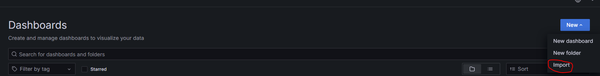
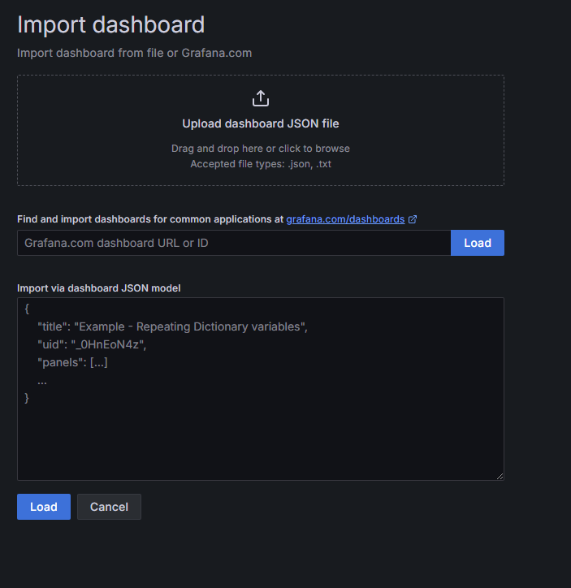
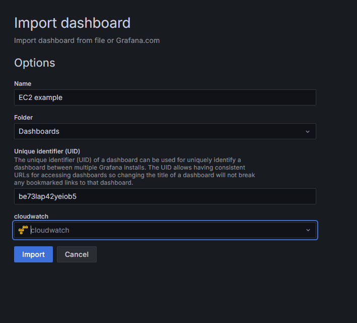

# The Spanish Decaffeination
A piece of software that Extracts, Transforms and Loads the data from a CSV file into AWS for a cafe chain.

## Project Background
The application is ran using Python on an AWS Lambda function, which gets triggered when a CSV is uploaded to the respective S3 bucket. From there, the lambda function transforms the data using Pandas and loads the data into a Redshift database, which can then be queried to create diagrams using Grafana on an EC2 instance.

## Client Requirements
The client requirements were based on the sample CSV files where, for each line, we must:

* Remove sensative information - Customer Name and Card number - these can't be stored *anywhere*
* Keep the CARD/CASH payment methods
* Split the transaction data of the products into seperate lines. e.g.:
    * "Large Iced americano - 2.50, Large Espresso - 1.80, Regular Espresso - 1.50" into seperate lines and remove the dashes
* All data must be normalised into 3rd normalised form - No duplicate data must be present in the database

This is because the cafe wants visualisation later on things like:

* Which branch was selling the most products?
* The total earnings by branch
* Which product is selling the most?

They also want visualisation on our Cloud Architecture performance and operations.

# Installation and Setup
## Requirements needed to run
* Python 3.12+
* Pip
* VSCode or Similar
* AWS CLI V2
* GitBash or an other terminal

* Requirements in requirements-lambda

## Set up

### AWS

To deploy the code on AWS, please do the following:

* Sign into AWS by typing the command aws sso login --profile [profie name]
* Navigate to de-nat-3-the-spanish-decaffeination-final-project using cd
* In gitbash, type ./deploy.sh (your-ip-address) and hit enter - you might need to change the variable your-name as our AWS had set up IAM roles with our team names.
    * It should create a CloudFormation stack that has the src folder and a bucket to upload the csv

### Using the Lambda Function to Transform the data
As the Python application only gets triggered by a CSV being uploaded into a S3 raw-data bucket, which you'll be able to find in (your-name)-etl-lambda. It should be called (your-name)-raw-data. Open up the S3 bucket and create a CSV with these sort of values:

> 17/12/2024 08:00,London Brixton,Elizabeth Bocanegra,Regular Iced americano - 2.15,2.15,CARD,6165637616213207
17/12/2024 08:00,London Brixton,Jennifer Nguyen,"Large Iced americano - 2.50, Large Espresso - 1.80, Regular Espresso - 1.50",5.8,CASH,
17/12/2024 08:01,London Brixton,Jorge Odonoghue,"Regular Speciality Tea - Earl Grey - 1.30, Large Hot chocolate - 2.90",4.2,CARD,1005251493048042
17/12/2024 08:02,London Brixton,Jonathan Berkowitz,"Regular Frappes - Strawberries & Cream - 2.75, Large Smoothies - Glowing Greens - 2.50, Regular Hot chocolate - 2.20, Large Smoothies - Glowing Greens - 2.50",9.95,CARD,8791058926266094
17/12/2024 08:03,London Brixton,James Reynolds,"Large Speciality Tea - Earl Grey - 1.60, Large Cappuccino - 2.45",4.05,CARD,6274413545913906
17/12/2024 08:04,London Brixton,Wayne Smallman,"Regular Cappuccino - 2.15, Large Frappes - Strawberries & Cream - 3.25, Regular Cappuccino - 2.15",7.55,CARD,3111061393129601
>

This can then be uploaded into the bucket to trigger the lambda function, which will transform the data and then load it into a Redshift database if it can find the login details using IAM rules.

### Grafana

To set up the to the database for visualisation, please do the following:

* Go into (your-name)-etl-lambda in CloudFormation, under Resources, click on GrafanaEC2Instances, which a mix of letters and numbers
* Once clicked, it takes you to the instances of EC2. Scroll to the right until you see Public IPv4 and copy the IP address
* In a new tab, type http://(paste IP) and hit enter, it should take you to the Grafana instance
* Enter admin in both username and password, which will then prompt you to change the password

* After you've changed your password, drop down connections and click on data sources
    * From here, go into parameter store, click on the database for the team and use the credentials listed
        * Host location as server:port
        * DB name - eg - la_vida_mocha_cafe_db
        * DB user - eg - la_vida_mocha_user
        * DB password - eg - password
    * Save and test
    * You should get a green box saying that the connection is OK
* You can now query the database to get visualisations

To set up CloudWatch, please do the following:

* Go into Data Sources and click on + Add new data source at the top right
* In the search bar, please type Cloudwatch
* In the config screen, please change the location you are in to where you have set up your Cloudformation
* Scroll to the bottom and add it, it should come up with a green box that it has connected

### Importing Dashboards into Grafana
To import the dashboards that were produced and can be located in the folder grafana_dashboards, please do the following:

* Go to dashboards and click on the drop down New button in the top right of the page. You should see 'Import', click on it:

* You should be taken to this page:

* Drag one of the JSON files into the 'Upload dashboard JSON file'. Upon uploading, you should get this:

* You won't need to change the name of the dashboard nor change the UID. All you would need to change is the data source. For Cloudwatch, select Cloudwatch, for the database select grafana-postgresql-datasource.
* Repeat for each dashboard! (You might need to change the EC2 instance to the instance you are using to monitor it)